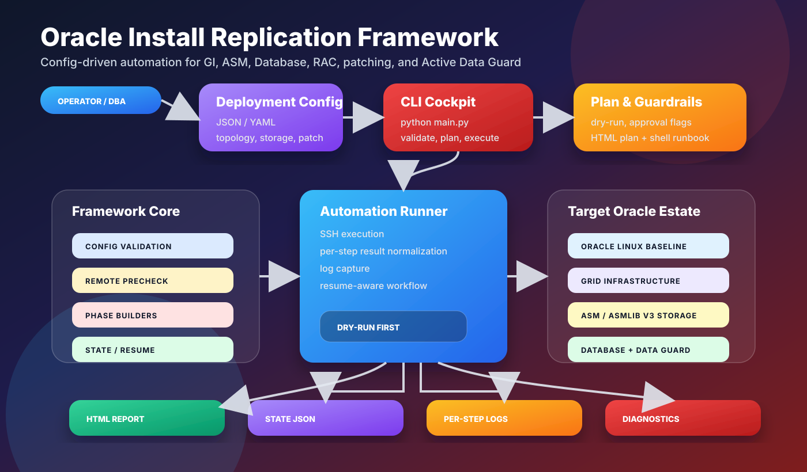
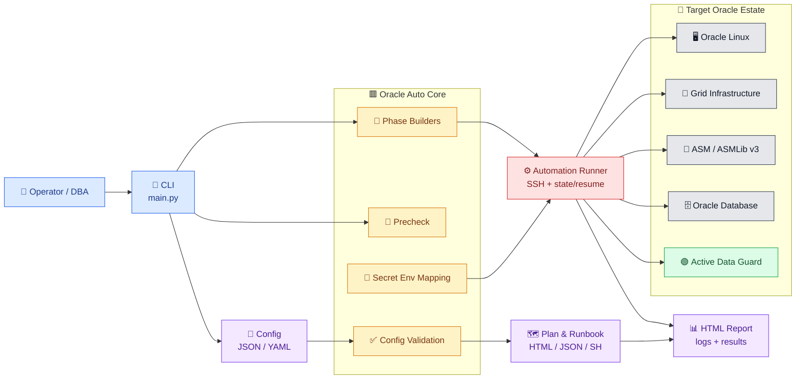

<div align="center">

# 🟥 Oracle Install Replication Framework

**Premium automation cockpit for Oracle Grid Infrastructure, ASM, Database, RAC, patching, and Active Data Guard.**


</div>

---

## ✨ Overview

Oracle Install Replication Framework adalah framework otomasi untuk membangun environment Oracle yang rapi, konsisten, dan bisa diaudit dari awal sampai siap operasi.

Framework ini fokus pada deployment fresh install dengan standar enterprise:

| Layer          | Fokus                                                                                     |
| -------------- | ----------------------------------------------------------------------------------------- |
| 🧭 Planning    | Validasi config, topology, execution plan, dan runbook per phase                          |
| 🖥️ Platform    | Oracle Linux baseline, user `grid`/`oracle`, DNS, hosts, chrony, SELinux, firewall        |
| 💽 Storage     | ASM auto-mode: multipath aktif pakai udev `/dev/asm/<LABEL>` dari `DM_UUID`, non-multipath pakai `ID_SERIAL`/`ID_WWN`/by-id, ASMLib v3 label `ORCL:*` |
| 🧱 Database    | Grid Infrastructure, ASM, Oracle Database software, DBCA primary database                 |
| 🟢 Replication | Active Data Guard dan optional Data Guard Broker                                          |
| 🛡️ Operations  | Dry-run, resume state, guardrail flag, diagnostics, role operation, HTML report           |

> README ini sengaja dibuat sebagai landing page. Detail teknis, command sequence, config schema, guardrail, troubleshooting, dan checklist production ada di [Deployment Guide](docs/deployment_guide.md).

---

## 🏗️ Architecture





---

## 🚀 What You Get

| Capability                | Output                                                                               |
| ------------------------- | ------------------------------------------------------------------------------------ |
| 🧪 Dry-run first workflow | Semua phase bisa direview sebelum SSH execution                                      |
| 🧾 Execution plan         | `.oracle-auto/reports/<run_id>-plan.html` dan runbook shell per phase                |
| 🔁 Resume state           | Step yang sudah `done` tidak diulang kecuali memakai `--no-resume`                   |
| 📦 Patch pipeline         | Clean/re-unzip home on install phase rerun, OPatch update inside home install, Grid/DB RU during initial install, OJVM before DB creation, inventory |
| 🟢 Data Guard path        | Manual physical standby atau Broker-managed configuration                            |
| 📊 Audit trail            | HTML report, state JSON, dan per-step log                                            |
| 🧯 Recovery aids          | Diagnostics, limited cleanup lab, limited framework rollback                         |

---

## 🧭 Deployment Modes

| Mode           | Topology                                         | Standby                             |
| -------------- | ------------------------------------------------ | ----------------------------------- |
| 🔹 `single-gi` | Single node Grid Infrastructure + ASM + Database | `single-gi` standby                 |
| 🔶 `rac`       | RAC Grid Infrastructure + ASM + Database         | RAC standby dengan jumlah node sama |

Jika `standby_site` diisi, Active Data Guard dianggap aktif otomatis.

---

## 📚 Documentation Map

| Document                                                                            | Purpose                                                                                               |
| ----------------------------------------------------------------------------------- | ----------------------------------------------------------------------------------------------------- |
| 📕 [Deployment Guide](docs/deployment_guide.md)                                     | Runbook teknis premium: prerequisites, config, command sequence, guardrails, reports, troubleshooting |
| 📘 [Installation and Replication Outline](docs/installation-replication-outline.md) | Blueprint desain, scope, default, dan roadmap framework                                               |
| 🧪 [single-gi-multisite](configs/single-gi-multisite.json)                         | Site A + Site B, Single GI, Data Guard mode dipilih portal/CLI                                        |
| 🧪 [rac-multisite](configs/rac-multisite.json)                                     | Site A + Site B, RAC, Data Guard mode dipilih portal/CLI                                              |
| 🧪 [single-gi](configs/single-gi.json)                                             | Site A only, Single GI, tanpa replikasi                                                               |
| 🧪 [rac](configs/rac.json)                                                         | Site A only, RAC, tanpa replikasi                                                                     |

---

## 🟢 Operator Entry Point

Mulai dari guide teknis:

```bash
python main.py validate-config --config configs/rac-multisite.json
python main.py generate-plan --config configs/rac-multisite.json --dataguard-mode manual
python main.py precheck --config configs/rac-multisite.json --dry-run
python main.py full --config configs/rac-multisite.json --dataguard-mode manual --dry-run
```

Untuk eksekusi end-to-end, gunakan `full`. Jika run terputus atau salah satu step gagal, jalankan `resume`
dengan config dan guardrail flag yang sama; state di `.oracle-auto/state/<run_id>.json` akan membuat step
yang sudah `done` dilewati. Gunakan `--no-resume` hanya jika perlu memaksa rerun.

Seluruh urutan deployment, flag destructive guardrail, dry-run penuh, dan production checklist ada di [Deployment Guide](docs/deployment_guide.md).

---

## 🛡️ Current Baseline

| Area               | Baseline                                                                 |
| ------------------ | ------------------------------------------------------------------------ |
| 🐍 Control runtime | Python `3.12`                                                            |
| 🐧 Target OS       | Oracle Linux `8.10`                                                      |
| 🟥 Oracle stack    | Grid Infrastructure + Database `19c`                                     |
| 🧩 Patch baseline  | Manifest-driven `19.30`; tambah `manifests/19.31.yaml` untuk patch berikutnya |
| 💽 Storage model   | ASM only; `single-gi` uses `DATA`/`RECO`, `rac` uses `OCR`/`DATA`/`RECO` |
| 🟢 Data Guard      | Active Data Guard, `max_performance`                                     |
| 📡 DNS model       | SCAN via DNS unless `scan_ip`/`scan_ips` is set; public/private/VIP managed through `/etc/hosts` |

---

## ⚠️ Validation Note

Framework sudah memiliki command structure, dry-run, state/resume, execution plan, runbook generation, dan HTML reporting. Phase yang menyentuh Oracle installer, GI, ASMLib/ASM, OPatch, RMAN duplicate, Broker, switchover, dan failover tetap wajib divalidasi di lab target sebelum production.
