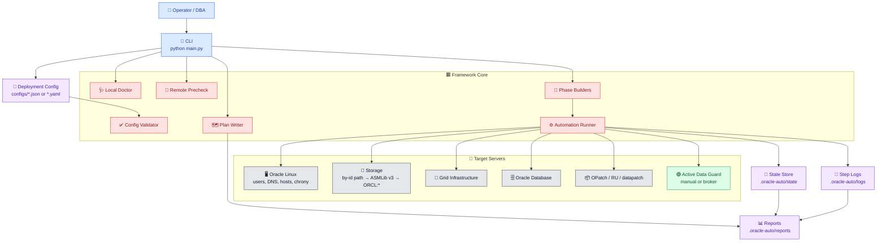
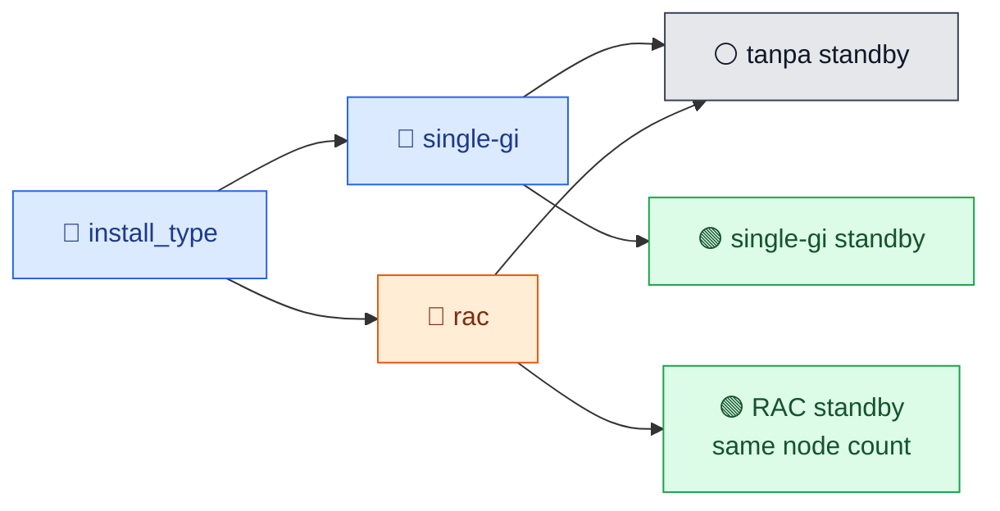
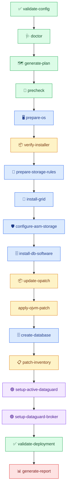

<div align="center">

# 🧭 Oracle Auto Deployment Guide

**Premium operator runbook untuk Oracle Grid Infrastructure, ASM, Database, RAC, patching, dan Active Data Guard.**


</div>

---

## 📌 Executive Runbook

Panduan ini adalah dokumen teknis utama untuk menjalankan Oracle Install Replication Framework. README hanya berisi overview; semua detail operasional, command, flag, config, storage, patching, Data Guard, report, dan troubleshooting ada di sini.

| Stage | Operator Goal | Primary Output |
|---|---|---|
| 🧪 Validate | Pastikan config dan control machine siap | Config summary, doctor result |
| 🔎 Inspect | Review target host tanpa perubahan besar | Inventory, precheck, logs |
| 🗺️ Plan | Generate execution plan sebelum SSH execution | HTML plan, JSON plan, runbook shell |
| 🧱 Build | Prepare OS, storage, GI, ASM, DB, patch | State, logs, report |
| 🟢 Replicate | Setup Active Data Guard dan optional Broker | Standby ready, DG validation |
| 📊 Prove | Generate report dan bukti audit | HTML report, per-step log |
| 🧯 Operate | Switchover, failover, diagnostics, cleanup lab | Role operation report |

---

## 🏗️ Architecture Diagram




---

## 🧭 Table of Contents

| Section | Content |
|---|---|
| [1. Prerequisites](#1-prerequisites) | Control machine, target server, and artifact readiness |
| [2. Deployment Type](#2-deployment-type) | `single-gi`, `rac`, and standby rules |
| [3. Config Preparation](#3-config-preparation) | Required config blocks and examples |
| [4. Network Model](#4-network-model) | SCAN DNS, `/etc/hosts`, VIP, private hostname |
| [5. ASM Storage](#5-asm-storage) | persistent by-id path atau multipath alias, ASMLib v3 label, `ORCL:*`, diskgroup mapping |
| [6. Installer and Patch](#6-installer-and-patch) | ZIP placement, OPatch, RU/OJVM/one-off model |
| [7. Data Guard](#7-data-guard) | Manual vs Broker, protection mode |
| [8. Secrets](#8-secrets) | Environment variable mapping |
| [9. Validation](#9-validation) | Config validation, doctor, inventory, precheck |
| [10. Deployment Sequence](#10-deployment-sequence) | Dry-run and real execution order |
| [11. Command Reference](#11-command-reference) | Per-command detail |
| [12. Operations](#12-operations) | Switchover, failover, diagnostics, cleanup |
| [13. State and Reports](#13-state-and-reports) | State, logs, plan, report, JSON output |
| [14. Troubleshooting](#14-troubleshooting) | Common failure paths |
| [15. Production Checklist](#15-production-checklist) | Readiness and lab matrix |

---

## 1. Prerequisites

### 🧰 Control Machine

| Requirement | Detail |
|---|---|
| 🐍 Python | `3.12` |
| 🔐 SSH | Akses SSH ke semua target host |
| 📁 Repository | Repository ini tersedia di control machine |
| 📘 Config | Config deployment dibuat dari sample |
| 📝 Writable artifact dirs | `.oracle-auto/state`, `.oracle-auto/logs`, `.oracle-auto/reports` |

### 🎯 Target Servers

| Requirement | Detail |
|---|---|
| 🐧 OS | Oracle Linux fresh install |
| 🔐 Bootstrap | SSH root aktif untuk bootstrap |
| 📡 DNS | Untuk RAC, SCAN DNS record wajib tersedia |
| 🧾 Hosts | Public/private/VIP hostname ditulis framework ke `/etc/hosts` |
| 📦 Installer | Installer dan patch ZIP sudah disalin manual ke target |
| 💽 Storage | Disk ASM terlihat sebagai persistent `/dev/disk/by-id/...` path atau stable `/dev/mapper/<alias>` |

Default installer path:

```text
/u01/sources
```

---

## 2. Deployment Type

Pilih salah satu install type:

| Type | Shape | Rule |
|---|---|---|
| 🔹 `single-gi` | Single node GI + ASM + database | Standby harus `single-gi` |
| 🔶 `rac` | RAC GI + ASM + database | Standby harus `rac` dengan jumlah node sama |

Active Data Guard otomatis aktif jika `standby_site` ada di config. Jika standby tidak dibutuhkan, hapus blok `standby_site`.



---

## 3. Config Preparation

Mulai dari sample:

```bash
cp configs/sample-rac-dg.json configs/my-deployment.json
```

Review blok berikut sebelum menjalankan command:

| Block | Purpose |
|---|---|
| 🏷️ `run_id` | Nama deployment dan prefix artifact |
| 🧱 `install_type` | `single-gi` atau `rac` |
| 🟥 `version` | Oracle Linux, GI/DB version, patch set |
| 🐧 `os` | Package manager, preinstall package, NTP, SELinux |
| 🔐 `ssh` | SSH user, port, option |
| 📡 `dns` | Resolver dan search domain |
| 🟦 `primary_site` | Site primary dan node list |
| 🟩 `standby_site` | Optional standby site |
| 💽 `asm` | Diskgroup dan disk persistent path / `DM_UUID` |
| 📦 `installer` | ZIP installer, OPatch, patch list |
| 🟢 `dataguard` | Manual atau Broker |
| 🔒 `secrets` | Nama environment variable password |

Validasi schema:

```bash
python main.py validate-config --config configs/my-deployment.json
```

---

## 4. Network Model

### 📡 Design Rule

| Object | Source of Truth | Notes |
|---|---|---|
| Public hostname/IP | Config | Ditulis ke `/etc/hosts` |
| Private interconnect IP | Config | RAC only, hostname generated |
| VIP IP | Config | RAC only, hostname generated |
| SCAN name | DNS | Jangan ditulis ke `/etc/hosts` |
| DNS resolver | Config | Ditulis ke target resolver config |

Generated hostname:

```text
db1.example.com -> db1-vip.example.com
db1.example.com -> db1-priv.example.com
```

DNS resolver example:

```json
"dns": {
  "resolvers": ["192.168.113.10", "192.168.115.10"],
  "search_domains": ["example.com"]
}
```

### ✅ SCAN Rules

| Rule | Status |
|---|---|
| SCAN must resolve from target resolver | Required |
| SCAN must not be added to `/etc/hosts` | Required |
| Public/private/VIP DNS validation | Ignored |
| Public/private/VIP `/etc/hosts` generation | Managed by framework |

---

## 5. ASM Storage

Storage selalu ASM. Untuk deployment produksi, input disk wajib memakai persistent path seperti `/dev/disk/by-id/...`, stable multipath alias seperti `/dev/mapper/ora_data01`, atau `DM_UUID` yang akan dinormalisasi ke `/dev/disk/by-id/dm-uuid-mpath-...`, bukan `/dev/mapper/mpathX` atau `/dev/sdX`. Jika primary dan standby punya by-id yang berbeda, gunakan `site_paths` supaya label ASMLib tetap sama tetapi source device path dipilih sesuai site yang sedang dieksekusi.


Example:

```json
"asm": {
  "redundancy": "EXTERNAL",
  "ocr_disks": [
    "360060e8008a3cf000050a3cf00000101",
    "360060e8008a3cf000050a3cf00000102",
    "360060e8008a3cf000050a3cf00000103"
  ],
  "data_disks": [
    "360060e8008a3cf000050a3cf00000104",
    "360060e8008a3cf000050a3cf00000105"
  ],
  "reco_disks": [
    "360060e8008a3cf000050a3cf00000106",
    "360060e8008a3cf000050a3cf00000107"
  ]
}
```

### 💽 Storage Rules

| Rule | Detail |
|---|---|
| No duplicate disk | UUID tidak boleh duplikat antar diskgroup |
| Prefix normalized | Input boleh dengan atau tanpa `mpath-` |
| Persistent path | Framework memakai `path`, `site_paths`, atau `node_paths` dari config (`/dev/disk/by-id/...` atau `/dev/mapper/<alias>`) atau derived `/dev/disk/by-id/dm-uuid-mpath-...` |
| Optional custom name | Disk object boleh memakai `name` |
| RAC consistency | Shared disk harus konsisten di semua node |
| Path mode | Object `path` harus menunjuk block device stabil yang sudah ada pada setiap node target |

Custom disk name:

```json
"data_disks": [
  {
    "uuid": "360060e8008a3cf000050a3cf00000175",
    "name": "data102"
  }
]
```

Path example:

```json
"data_disks": [
  {
    "path": "/dev/disk/by-id/google-data1",
    "name": "data01"
  }
]
```

Jika topologi memakai `path`, precheck akan gagal sampai path tersebut benar-benar ada di semua host yang memakai config itu.

Per-site path example:

```json
"data_disks": [
  {
    "site_paths": {
      "site-a": "/dev/disk/by-id/google-primary-data1",
      "site-b": "/dev/disk/by-id/google-standby-data1"
    },
    "name": "data01"
  }
]
```

Untuk RAC atau kondisi path berbeda per host dalam site yang sama, gunakan `node_paths` dengan key hostname node.

Multipath alias example:

```json
"data_disks": [
  {
    "path": "/dev/mapper/ora_data01",
    "name": "data01"
  }
]
```

ASMLib discovery shape:

```text
oracle.install.asm.diskGroup.diskDiscoveryString=ORCL:*
oracle.install.asm.diskGroup.disks=ORCL:DATA01
```

---

## 6. Installer and Patch

Operator menyalin file ZIP manual ke target server. Framework memverifikasi file, mengekstrak base home, menerapkan Grid RU saat `install-grid`, menerapkan DB RU saat `install-db-software`, mengupdate OPatch, menerapkan OJVM ke DB home sebelum `create-database`, dan menyimpan inventory.

```json
"installer": {
  "sources_path": "/u01/sources",
  "grid_zip": "LINUX.X64_193000_grid_home.zip",
  "db_zip": "LINUX.X64_193000_db_home.zip",
  "opatch_zip": "p6880880_190000_Linux-x86-64.zip",
  "grid_patch": {
    "name": "19.30 Grid RU",
    "type": "ru",
    "file": "p37642901_190000_Linux-x86-64.zip",
    "patch_id": "37642901"
  },
  "db_patch": {
    "name": "19.30 Database RU",
    "type": "ru",
    "file": "p37642901_190000_Linux-x86-64.zip",
    "patch_id": "37642901"
  },
  "ojvm_patch": {
    "name": "19.30 OJVM RU",
    "type": "ojvm",
    "file": "p19_30_ojvm_ru_Linux-x86-64.zip"
  }
}
```

`grid_patch` dipakai oleh `gridSetup.sh -applyRU` saat install Grid. `db_patch` dipakai oleh `runInstaller -applyRU` saat install Database home. Setelah installer selesai, framework wajib memvalidasi `OPatch/opatch lspatches` dan `oraversion`; status sukses baru dicetak setelah RU terlihat di inventory. `patch_id` opsional jika nama ZIP sudah memakai pola Oracle `p<patch_id>_...`, tetapi disarankan diisi eksplisit supaya validasi tidak menebak. `ojvm_patch` dipasang dengan OPatch setelah DB home selesai dan sebelum DBCA membuat database baru.

---

## 7. Data Guard

Jika `standby_site` diisi, Active Data Guard otomatis aktif.

```json
"dataguard": {
  "configuration_method": "broker",
  "protection_mode": "max_performance"
}
```

| Method | Use Case |
|---|---|
| 🟡 `manual` | Physical standby tanpa Broker |
| 🟢 `broker` | Recommended untuk manageability dan role operation |

Protection mode baseline:

```text
max_performance
```

---

## 8. Secrets

Password tidak ditulis hardcoded di script. Config hanya menyimpan nama environment variable yang harus tersedia di target saat step terkait dijalankan.

```json
"secrets": {
  "sys_password_env": "ORACLE_AUTO_SYS_PASSWORD",
  "system_password_env": "ORACLE_AUTO_SYSTEM_PASSWORD",
  "asmsnmp_password_env": "ORACLE_AUTO_ASMSNMP_PASSWORD",
  "dg_password_env": "ORACLE_AUTO_DG_PASSWORD"
}
```

Default runtime membaca secret dari file root-only berikut di setiap target:

```text
/etc/oracle-auto/secrets.env
```

Format file:

```bash
ORACLE_AUTO_SYS_PASSWORD='change-me'
ORACLE_AUTO_SYSTEM_PASSWORD='change-me'
ORACLE_AUTO_ASMSNMP_PASSWORD='change-me'
ORACLE_AUTO_DG_PASSWORD='change-me'
```

Permission yang direkomendasikan:

```bash
sudo install -d -m 700 -o root -g root /etc/oracle-auto
sudo install -m 600 -o root -g root secrets.env /etc/oracle-auto/secrets.env
```

Precheck membaca file ini lewat `sudo -n bash -lc`, dan setiap remote phase
akan source file ini sebelum menjalankan command. Jangan simpan password di
`/etc/profile.d` atau shell profile global.

---

## 9. Validation

### ✅ Config Validation

```bash
python main.py validate-config --config configs/my-deployment.json
```

Expected result:

| Check | Expected |
|---|---|
| Config parse | Valid |
| Install type | `single-gi` atau `rac` |
| Node count | Primary/standby cocok |
| ASM diskgroup | Count dan duplicate valid |
| DNS resolver | Tampil |
| Active Data Guard | Enabled jika standby ada |

### 🩺 Local Doctor

```bash
python main.py doctor --config configs/my-deployment.json
```

Doctor mengecek Python version, SSH binary, writable report/state/log directory, config parseability, dan optional YAML support.

### 📋 Remote Inventory

```bash
python main.py inventory --config configs/my-deployment.json --dry-run
python main.py inventory --config configs/my-deployment.json
```

Inventory membantu review OS, network, DNS, storage persistent path / `DM_UUID`, dan isi `/u01/sources`.

### 🔎 Precheck

```bash
python main.py precheck --config configs/my-deployment.json --dry-run
python main.py precheck --config configs/my-deployment.json
```

Precheck memvalidasi:

| Area | Checks |
|---|---|
| 🔐 Access | SSH connectivity, sudo, user switching |
| 🐧 OS | Oracle Linux version, kernel, package manager, repo, preinstall package |
| 📡 Network | DNS resolver, `/etc/hosts`, SCAN resolution, FQDN |
| 📦 Installer | ZIP file existence, integrity, source path |
| 💽 Storage | persistent path visibility, disk sizes, ASMLib readiness, multipath |
| 🧱 Services | chrony/time sync, SELinux status |
| 🟢 RAC hints | Private interconnect and SCAN record count |

---

## 10. Deployment Sequence

Selalu mulai dengan plan dan dry-run penuh.



### 🧪 Dry-run Sequence

```bash
python main.py generate-plan --config configs/my-deployment.json
python main.py full --config configs/my-deployment.json --dry-run
```

Gunakan dry-run per phase jika ingin inspect bagian tertentu:

```bash
python main.py precheck --config configs/my-deployment.json --dry-run
python main.py prepare-os --config configs/my-deployment.json --dry-run
python main.py verify-installer --config configs/my-deployment.json --dry-run
python main.py prepare-storage-rules --config configs/my-deployment.json --dry-run
python main.py install-grid --config configs/my-deployment.json --dry-run
python main.py configure-asm-storage --config configs/my-deployment.json --dry-run
python main.py install-db-software --config configs/my-deployment.json --dry-run
python main.py update-opatch --config configs/my-deployment.json --dry-run
python main.py apply-ojvm-patch --config configs/my-deployment.json --dry-run
python main.py create-database --config configs/my-deployment.json --dry-run
python main.py patch-inventory --config configs/my-deployment.json --dry-run
python main.py setup-active-dataguard --config configs/my-deployment.json --dry-run
python main.py setup-dataguard-broker --config configs/my-deployment.json --dry-run
python main.py validate-deployment --config configs/my-deployment.json --dry-run
```

Jika dry-run sudah sesuai, jalankan command yang sama tanpa `--dry-run` dan tambahkan guardrail flag yang diwajibkan.

Untuk menjalankan workflow end-to-end:

```bash
python main.py full --config configs/my-deployment.json --allow-storage-changes --allow-patch-apply
```

Jika run berhenti di tengah, perbaiki penyebab failure lalu lanjutkan dari state yang sama:

```bash
python main.py resume --config configs/my-deployment.json --allow-storage-changes --allow-patch-apply
```

Untuk mulai dari phase tertentu tanpa mengubah state:

```bash
python main.py resume --config configs/my-deployment.json --from-phase install-db-software --allow-patch-apply
```

### 🛡️ Destructive Guardrails

| Command Group | Required Flag for Real Execution |
|---|---|
| `full`, `resume` | `--allow-storage-changes` dan `--allow-patch-apply` jika workflow mencakup storage/patch phase |
| `prepare-storage-rules`, `configure-asm-storage`, `prepare-storage` | `--allow-storage-changes` |
| `update-opatch`, `analyze-patch`, `apply-grid-patch`, `apply-db-patch`, `apply-ojvm-patch`, `datapatch`, `apply-patch` | `--allow-patch-apply` |
| `failover`, `cleanup-lab`, `rollback-framework` | `--yes` |

---

## 11. Command Reference

### 🖥️ `prepare-os`

Menjalankan OS bootstrap:

| Action | Detail |
|---|---|
| Package baseline | Install preinstall package, chrony, unzip, tar, libnsl |
| Users/groups | Membuat group Oracle, user `grid`, user `oracle` |
| Layout | Membuat `/u01`, homes, source, stage |
| Network | DNS resolver dan `/etc/hosts` generated block |
| Services | Disable firewall, set SELinux `permissive`, configure chrony |

```bash
python main.py prepare-os --config configs/my-deployment.json
```

### 📦 `verify-installer`

Memastikan file ZIP tersedia dan bisa dibaca:

| File | Owner Context |
|---|---|
| Grid ZIP | `grid` |
| DB ZIP | `oracle` |
| OPatch ZIP | `grid` dan `oracle` |
| Patch ZIP list | Sesuai config order |

```bash
python main.py verify-installer --config configs/my-deployment.json
```

### 💽 `prepare-storage-rules`

Menyiapkan storage rules sebelum GI/ASM bergantung pada device:

| Action | Detail |
|---|---|
| Resolve path | Dari `path` config (`/dev/disk/by-id/...` atau `/dev/mapper/<alias>`) atau derived `DM_UUID` |
| Permission | Set owner/group/mode pada resolved block device |
| Label | `oracleasm createdisk <LABEL> <resolved-path>` |

```bash
python main.py prepare-storage-rules --config configs/my-deployment.json --allow-storage-changes
```

### 🧱 `install-grid`

Menjalankan Grid Infrastructure silent install dan root scripts.

```bash
python main.py install-grid --config configs/my-deployment.json
```

### 🛡️ `configure-asm-storage`

Menyiapkan ASM storage setelah GI tooling tersedia:

| Action | Detail |
|---|---|
| Validate ASMLib | `oracleasm scandisks` dan `oracleasm listdisks` |
| Disk discovery | ASM memakai `ORCL:*` dan disk list `ORCL:<LABEL>` |
| Create diskgroup | `OCR`, `DATA`, `RECO` |
| Validate diskgroup | Diskgroup terlihat pada target |

```bash
python main.py configure-asm-storage --config configs/my-deployment.json --allow-storage-changes
```

### 🗄️ `install-db-software`

Menjalankan Oracle Database software silent install.

```bash
python main.py install-db-software --config configs/my-deployment.json
```

### 📦 Patch Commands

| Command | Purpose |
|---|---|
| `update-opatch` | Replace/update OPatch in Grid and DB homes |
| `analyze-patch` | Analyze configured Grid and DB patch conflicts/readiness |
| `apply-grid-patch` | Apply configured Grid patch to Grid home |
| `apply-db-patch` | Apply configured DB patch to DB home |
| `apply-ojvm-patch` | Apply configured OJVM patch to DB home before DB creation |
| `datapatch` | Run datapatch on an already-created primary database home |
| `patch-inventory` | Collect OPatch inventory |
| `apply-patch` | Compatibility wrapper for patch flow |

```bash
python main.py update-opatch --config configs/my-deployment.json --allow-patch-apply
python main.py analyze-patch --config configs/my-deployment.json --allow-patch-apply
python main.py apply-grid-patch --config configs/my-deployment.json --allow-patch-apply
python main.py apply-db-patch --config configs/my-deployment.json --allow-patch-apply
python main.py apply-ojvm-patch --config configs/my-deployment.json --allow-patch-apply
python main.py datapatch --config configs/my-deployment.json --allow-patch-apply
python main.py patch-inventory --config configs/my-deployment.json
```

### 🗄️ `create-database`

Membuat primary database dengan DBCA silent.

```bash
python main.py create-database --config configs/my-deployment.json
```

### 🟢 `setup-active-dataguard`

Menyiapkan Data Guard parameter, password file baseline, RMAN duplicate, dan managed recovery.

```bash
python main.py setup-active-dataguard --config configs/my-deployment.json
```

### 🟢 `setup-dataguard-broker`

Berjalan jika `configuration_method=broker`.

```bash
python main.py setup-dataguard-broker --config configs/my-deployment.json
```

### ✅ `validate-deployment`

Validasi GI, ASM, database role, service, dan Data Guard metrics.

```bash
python main.py validate-deployment --config configs/my-deployment.json
```

### 🧩 Implementation Trace

| Command Area | Module |
|---|---|
| OS | `oracle_auto/phase_builders/os.py` |
| Installer | `oracle_auto/phase_builders/installer.py` |
| Storage | `oracle_auto/phase_builders/storage.py` |
| Grid | `oracle_auto/phase_builders/grid.py` |
| Database | `oracle_auto/phase_builders/database.py` |
| Patching | `oracle_auto/phase_builders/patching.py` |
| Data Guard | `oracle_auto/phase_builders/dataguard.py` |
| Validation | `oracle_auto/phase_builders/validation.py` |
| Role operation | `oracle_auto/phase_builders/role.py` |
| Diagnostics | `oracle_auto/phase_builders/diagnostics.py` |
| Inventory | `oracle_auto/phase_builders/inventory.py` |

---

## 12. Operations

### 🔁 Switchover

Dry-run:

```bash
python main.py switchover --config configs/my-deployment.json --dry-run
```

Execute:

```bash
python main.py switchover --config configs/my-deployment.json
```

Post-check:

```bash
python main.py validate-deployment --config configs/my-deployment.json
python main.py generate-report --config configs/my-deployment.json
```

### 🚨 Failover

Failover adalah destructive role operation. Dry-run dulu:

```bash
python main.py failover --config configs/my-deployment.json --dry-run
```

Execute membutuhkan `--yes`:

```bash
python main.py failover --config configs/my-deployment.json --yes
```

Setelah failover:

| Action | Reason |
|---|---|
| Validate primary baru | Pastikan service role benar |
| Review former primary | Tentukan rebuild atau reinstate |
| Generate report | Simpan bukti operasi |

### 🧯 Diagnostics

```bash
python main.py collect-diagnostics --config configs/my-deployment.json
```

### 🧹 Limited Lab Cleanup

```bash
python main.py cleanup-lab --config configs/my-deployment.json --yes
```

### ↩️ Limited Framework Rollback

```bash
python main.py rollback-framework --config configs/my-deployment.json --yes
```

Cleanup/rollback menghapus artifact framework seperti generated `/etc/hosts` block, generated chrony block, selected staged diagnostics/state, dan restore `/etc/resolv.conf` dari backup jika ada. Command ini tidak menghapus Oracle home, database, ASMLib label, atau diskgroup.

---

## 13. State and Reports

### 🔁 State and Resume

State disimpan di:

```text
.oracle-auto/state/<run_id>.json
```

Default behavior:

| Behavior | Detail |
|---|---|
| Resume enabled | Step `done` tidak dijalankan ulang |
| Force rerun | Gunakan `--no-resume` |
| Dry-run state | Tidak menulis state permanen |

Example:

```bash
python main.py verify-installer --config configs/my-deployment.json --no-resume
python main.py resume --config configs/my-deployment.json --allow-storage-changes --allow-patch-apply
python main.py resume --config configs/my-deployment.json --from-phase install-grid --to-phase create-database --allow-storage-changes --allow-patch-apply
```

### 🗺️ Execution Plan

```bash
python main.py generate-plan --config configs/my-deployment.json
```

Output:

```text
.oracle-auto/reports/<run_id>-plan.html
.oracle-auto/reports/<run_id>-plan.json
.oracle-auto/reports/<run_id>-runbook.sh
.oracle-auto/reports/<run_id>-phase-runbooks/<phase>.sh
```

Plan dan runbook menampilkan mapping storage `DM_UUID/path -> persistent by-id path -> ASMLib label`.

### 🧾 Step Logs

```text
.oracle-auto/logs/<run_id>/<phase>/<host>/<step>.log
```

### 📊 HTML Report

```bash
python main.py generate-report --config configs/my-deployment.json
```

Lokasi:

```text
.oracle-auto/reports/<run_id>.html
```

Report berisi:

| Section | Content |
|---|---|
| Identity | `run_id`, version baseline, topology |
| Network | Generated private/VIP hostnames, DNS resolver, SCAN status |
| Storage | ASM `DM_UUID`, persistent device path, ASMLib label, diskgroup mapping |
| Installer | Installer and patch list |
| Execution | Result, failure, warning, log path |
| Data Guard | Standby and Broker status where applicable |

### 🧩 JSON Output

Gunakan `--json` untuk integrasi pipeline:

```bash
python main.py validate-deployment --config configs/my-deployment.json --json
```

### ⏭️ Continue on Fail

Gunakan hanya untuk audit luas ketika ingin melihat semua failure dalam satu run:

```bash
python main.py precheck --config configs/my-deployment.json --continue-on-fail
```

Untuk install sungguhan, lebih aman berhenti di failure pertama, perbaiki, lalu resume.

---

## 14. Troubleshooting

### ❌ Config Gagal

| Symptom | Check |
|---|---|
| Invalid install type | Cek `install_type` |
| Standby mismatch | Cek node count primary/standby |
| ASM duplicate | Cek UUID disk antar diskgroup |
| Missing ZIP config | Cek `grid_zip`, `db_zip`, patch list |

### 📡 SCAN Gagal Resolve

| Check | Detail |
|---|---|
| DNS resolver | Pastikan resolver reachable dari target |
| `/etc/resolv.conf` | Pastikan resolver config benar |
| SCAN record | Pastikan DNS punya SCAN record |
| No hosts workaround | Jangan masukkan SCAN ke `/etc/hosts` |

### 📦 Installer Verification Gagal

| Check | Detail |
|---|---|
| File exists | ZIP ada di `sources_path` |
| File size | Size tidak `0` |
| Permission | Bisa dibaca user target |
| Filename | Nama sesuai config |

### 💽 ASM Disk Gagal

| Check | Detail |
|---|---|
| UUID | `DM_UUID` benar |
| persistent path | `/dev/disk/by-id/...` atau `/dev/mapper/<alias>` ada dan resolve ke block device |
| ASMLib | `oracleasm listdisks` menampilkan label yang diharapkan |
| Multipath | Path sehat dan konsisten |
| RAC | Disk shared konsisten di semua node |

### 📦 Patch Gagal

| Check | Detail |
|---|---|
| OPatch | Version sesuai patch requirement |
| Patch unzip | Patch top terdeteksi benar |
| Conflict | Review analyze result |
| Tooling | Cek apakah patch perlu `opatchauto` atau `opatch` |

### 🟢 Data Guard Gagal

| Check | Detail |
|---|---|
| Listener | Service name dan listener reachable |
| Password file | Password file primary/standby benar |
| `tnsnames.ora` | Entry primary dan standby benar |
| Archive mode | Archive log dan force logging aktif |
| Network | Primary ke standby dan sebaliknya reachable |

---

## 15. Production Checklist

### ✅ Readiness Checklist

| Item | Status |
|---|---|
| Config direview DBA dan infra | ☐ |
| SCAN DNS siap | ☐ |
| Public/private/VIP benar untuk `/etc/hosts` generation | ☐ |
| ASM disk `DM_UUID` valid | ☐ |
| Installer dan patch ZIP benar | ☐ |
| `generate-plan` direview | ☐ |
| Dry-run semua command direview | ☐ |
| Remote precheck bersih dari `FAIL` | ☐ |
| Backup atau rollback plan tersedia | ☐ |
| Switchover/failover punya window dan approval | ☐ |

### 🧪 Lab Test Matrix

Sebelum production, validasi minimal:

| Matrix | Required Evidence |
|---|---|
| `single-gi` tanpa standby | Plan, precheck, validate, report |
| `single-gi` dengan standby | Plan, precheck, validate, DG report |
| `rac` tanpa standby | Plan, precheck, validate, patch inventory |
| `rac` dengan standby method `manual` | Plan, precheck, validate, DG report |
| `rac` dengan standby method `broker` | Plan, precheck, Broker validate, DG report |

Untuk setiap matrix, simpan `generate-plan`, `precheck`, `validate-deployment`, `patch-inventory`, dan HTML report sebagai bukti review.
